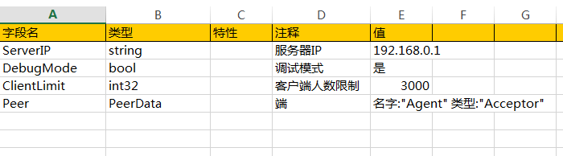

# tabtoy

游戏客户端,服务器的策划表格数据导出


# 优点

* 编写电子表格, 导出. 只需2步, 即可导出数据!

* 跨平台运行, 无第三方依赖, 无需任何的vbs,vba,dll

* 支持文件格式最多的导出器(json, lua, C#+二进制, protobuf text, proto, golang) 

* 一次设置, 自动生成索引代码, 支持lua, C#

* 单元格字段列顺序随意调整, 自动检查错误, 精确报错位置

* 强类型, 导出时自动类型检查, 提前暴露表格错误

* 支持中文枚举值, 中文结构体字段, 编写,更直观

* 支持同类型表拆分, 多人协作填表导出互不影响

* 支持纵向填写字段作为配置, 将电子表格作为快速配置文件

* 全中文导出提示,并支持多语言导出提示

* 支持导出Tag匹配,导出需要的部分, 避免客户端混合服务器私密数据

* 支持类型信息导出, 方便无反射的语言(例如C++)使用

* 充分利用CPU多核进行导出, 是已知的现有导出器中速度最快的

# 商用项目

* Mad Magic
	https://itunes.apple.com/app/id1146098397

* 消诺克
	http://www.taptap.com/app/15881

* Fairy in Wonderland
    https://itunes.apple.com/us/app/fairy-in-wonderland-parkour/id1128656892?l=zh&ls=1&mt=8

# 迭代历程

* 2016年8月: 第六代导出器,tabtoy v2 调整为以电子表格为中心的方式, 支持v1 90%常用功能

	增加: 所有导出文件均为1个文件, 提高加载读取速度

	增加: 二进制合并导出(第五代导出器需要使用2个工具才能完成)
	
	增加: C#源码导出及索引创建,无需protobuf支持
	
	增加: proto格式导出, 支持v2,v3格式
		
	重构代码, 导出速度更快

* 2016年3月: 第五代导出器,tabtoy v1 在四代基础上重构,开源,支持并发导出	

* 2015年: 第四代导出器,基于Golang导出器,增加ID重复检查,数组格的多重写法, 支持a.b.c栏位导出, 导出速度大大提高

* 2013年: 第三代导出器,在二代基础上做到内容格式与导出器独立,但依然依赖csv前置导出,增加逗号分隔格子内容,导出速度慢

* 2012年: 第二代导出器,基于C++和Protobuf的导出器,内容格式与导出器混合编写,需要vbs导出csv,速度慢
	
* 2011年: 第一代导出器,基于VBA的表格内建导出器,速度慢,复用困难,容易错,不安全


# 导出性能

53个Excel源文件, 格式xlsm, 大小3.8M

导出速度(硬件环境: i7-4790 8核+SSD),  2.4s

# 第六代导出器文档(tabtoy v2)


功能强大的的导出表格式


详细的输出日志及报错信息,以及精准到单元格的多语言报错

## 导出步骤

### 准备电子表格文件

格式请参考:
	
	https://github.com/davyxu/tabtoy/blob/master/v2/example/Sample.xlsx
	
	
### 准备tabtoy二进制

* 已经编译好的二进制:
	
	[https://github.com/davyxu/tabtoy/releases](https://github.com/davyxu/tabtoy/releases)
	
* 手动编译获取最新版
	
	go get -u -v github.com/davyxu/tabtoy
	
### 编写导出命令行

范例:
		
```bat

tabtoy --mode=v2 --json_out=config.json --combinename=Config Table.xlsx

```
* 注意: 不要将这个命令行指令对例子表格进行导出, 例子表格包含类型信息, 需要多个表格组合导出

### Golang读取例子

	[例子](https://github.com/davyxu/tabtoy/tree/master/v2/example/golang)
	
```golang
	config := table.NewConfigTable()

	if err := config.Load("Config.json"); err != nil {
		panic(err)
	}

	for index, v := range config.SampleByID {
		fmt.Println(index, v)
	}
```
	
	

### C#读取例子
	
	[例子](https://github.com/davyxu/tabtoy/tree/master/v2/example/csharp)

```csharp
    using (var stream = new FileStream("../../../../Config.bin", FileMode.Open))
    {
        stream.Position = 0;

        var reader = new tabtoy.DataReader(stream);
        
        if ( !reader.ReadHeader( ) )
        {
            Console.WriteLine("combine file crack!");
            return;
        }

        var config = new gamedef.Config();
        table.Config.Deserialize(config, reader);                

        // 直接通过下标获取或遍历
        var directFetch = config.Sample[2];

        // 根据索引取
        var indexFetch = config.GetSampleByID(100);

        // 取不存在的元素时, 返回给定的默认值, 避免空
        var indexFetchByDefault = config.GetSampleByID(0, new gamedef.SampleDefine() );

        // 添加日志输出或自定义输出
        config.TableLogger.AddTarget( new tabtoy.DebuggerTarget() );

        // 取空时, 当默认值不为空时, 输出日志
        var nullFetchOutLog = config.GetSampleByID( 0 );

    }
```

### lua读取例子

	[例子](https://github.com/davyxu/tabtoy/tree/master/v2/example/lua)

```lua
-- 添加搜索路径
package.path = package.path .. ";../?.lua"

-- 加载
local t = require "Config"

-- 直接访问原始数据
print(t.Sample[1].Name)

-- 通过索引访问
print(t.SampleByID[103].ID)

print(t.SampleByName["黑猫警长"].ID)
```


## 所有例子
	
[例子](https://github.com/davyxu/tabtoy/blob/master/v2/example)

* 注意: 例子中展现的是一般项目中多表的使用方法

	共享的类型信息会被统一放在Globals表中, 最终导出时, 需要将Globals和其他表一起配合导出


## 详细文档

[文档](https://github.com/davyxu/tabtoy/blob/master/doc/Manual_V2.md)

[错误描述](https://github.com/davyxu/tabtoy/blob/master/doc/error_v2.md)


## 功能扩展

### 多表合并导出
一些表格, 如角色, 道具的表格, 会将角色或道具充当不同的角色和功能, 例如: 道具作为装备
道具作为宠物,  boss配置, 怪物配置, npc配置等等

tabtoy支持按功能分类后的表格, 导出时保持一致的表头及类型, 方便策划拆表进行多人协作

[例子](https://github.com/davyxu/tabtoy/tree/master/v2/example/combine)

```bat

tabtoy --mode=v2 --json_out=CombineConfig.json --combinename=Config Item.xlsx+Item_Equip.xlsx+Item_Pet.xlsx

```

需要合并的同类表格间使用'+'互相连接


### 导出Tag匹配
如果客户端使用C#并读取二进制导出数据, 服务器使用golang开发读取json

* 我们不希望新手引导的表导入到服务器的配置文件中, 可以这么做:

	在新手引导表的@Types表单里添加OutputTag: [".cs", ".bin"]

* 我们不希望服务器的ip配置表导入到客户端的配置文件中, 可以这么做:

	在ip配置表的@Types表单里添加OutputTag: [".go", ".json"]

减少数据冗余和保证客户端数据安全, tabtoy已经为你考虑

### 支持纵向导出, 用于配置表


[例子](https://github.com/davyxu/tabtoy/tree/master/v2/example/verticalconfig)

# 备注

感觉不错请star, 谢谢!

开源讨论群: 527430600

知乎: [http://www.zhihu.com/people/sunicdavy](http://www.zhihu.com/people/sunicdavy)

提交bug及特性: [https://github.com/davyxu/tabtoy/issues](https://github.com/davyxu/tabtoy/issues)
