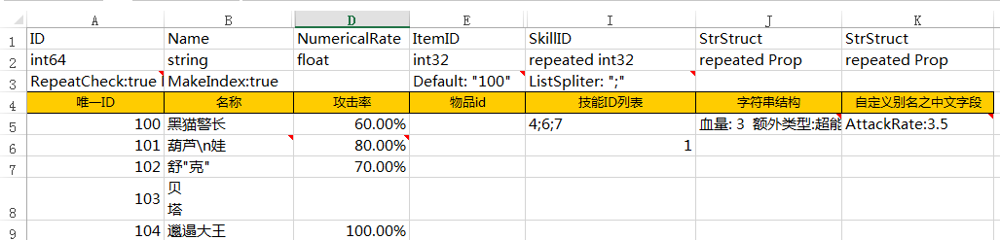
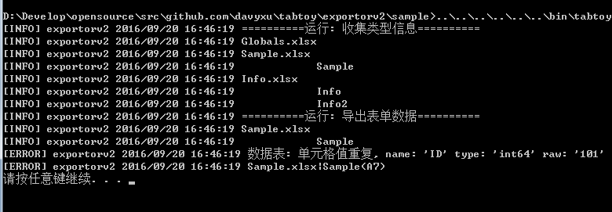

# tabtoy

游戏客户端,服务器的策划表格数据导出

# 优点

* 只需3步, 即可导出数据, 无任何其他工具依赖

* 无需依赖vbs,vba,dll, 跨平台

* 支持文件格式最多的导出器(json, lua, C#+二进制, pbt+proto) 

* 一次设置, 自动生成索引代码, 支持lua, C#

* 单元格字段列随意调整, 自动检查错误, 精确报错位置

* 充分利用CPU多核进行导出, 是已知的现有导出器中最快的

* 持续更新, 不断添加新功能, 提高工作效率

# 商用项目

* Fairy in Wonderland
	https://itunes.apple.com/us/app/fairy-in-wonderland-parkour/id1128656892?l=zh&ls=1&mt=8
	
* Mad Magic
	https://itunes.apple.com/app/id1146098397

* 消诺克
	http://www.taptap.com/app/15881

# 迭代历程

* 2016年8月: 第六代导出器,tabtoy v2 调整为以电子表格为中心的方式, 支持v1 90%常用功能

	增加: 所有导出文件均为1个文件, 提高加载读取速度

	增加: 二进制合并导出(第五代导出器需要使用2个工具才能完成)
	
	增加: C#源码导出及索引创建,无需protobuf支持
	
	增加: proto格式导出, 支持v2,v3格式
		
	重构代码, 导出速度更快

* 2016年3月: 第五代导出器,tabtoy v1 在四代基础上重构,开源,支持并发导出	

* 2015年: 第四代导出器,基于Golang导出器,增加ID重复检查,数组格的多重写法, 支持a.b.c栏位导出, 导出速度大大提高

* 2013年: 第三代导出器,在二代基础上做到内容格式与导出器独立,但依然依赖csv前置导出,增加逗号分隔格子内容,导出速度慢

* 2012年: 第二代导出器,基于C++和Protobuf的导出器,内容格式与导出器混合编写,需要vbs导出csv,速度慢
	
* 2011年: 第一代导出器,基于VBA的表格内建导出器,速度慢,复用困难,容易错,不安全


# 应用情况

前面多个版本都在本人项目中使用, 2个非本人项目商用

53个Excel源文件, 格式xlsm, 大小3.8M

导出速度(硬件环境: i7-4790 8核+SSD)

* 9.4s 第四代导出器

* 4.9s 第五代导出器单线程

* 2.4s 第五代导出器

# 第六代导出器文档(tabtoy v2)


功能强大的的导出表格式


详细的输出日志及报错信息,以及精准到单元格的多语言报错

## 导出步骤

### 准备电子表格文件

格式请参考:
	
	https://github.com/davyxu/tabtoy/blob/master/exportorv2/sample/Sample.xlsx
	
	
### 准备tabtoy二进制

* 已经编译好的二进制:
	
	https://github.com/davyxu/tabtoy/releases
	
* 手动编译
	
	go get github.com/davyxu/tabtoy
	
### 编写导出命令行

范例:
		
```bat

tabtoy --mode=exportorv2 --json_out=.\config.json Table.xlsx

```

## 例子
	
https://github.com/davyxu/tabtoy/blob/master/exportorv2/sample

## 详细文档

推荐!

https://github.com/davyxu/tabtoy/blob/master/doc/Manual_V2.md

# 第五代导出器文档(tabtoy v1)

已停止开发

https://github.com/davyxu/tabtoy/blob/master/doc/Manual_V1.md


# 备注

感觉不错请star, 谢谢!

博客: http://www.cppblog.com/sunicdavy

知乎: http://www.zhihu.com/people/xu-bo-62-87

邮箱: sunicdavy@qq.com
